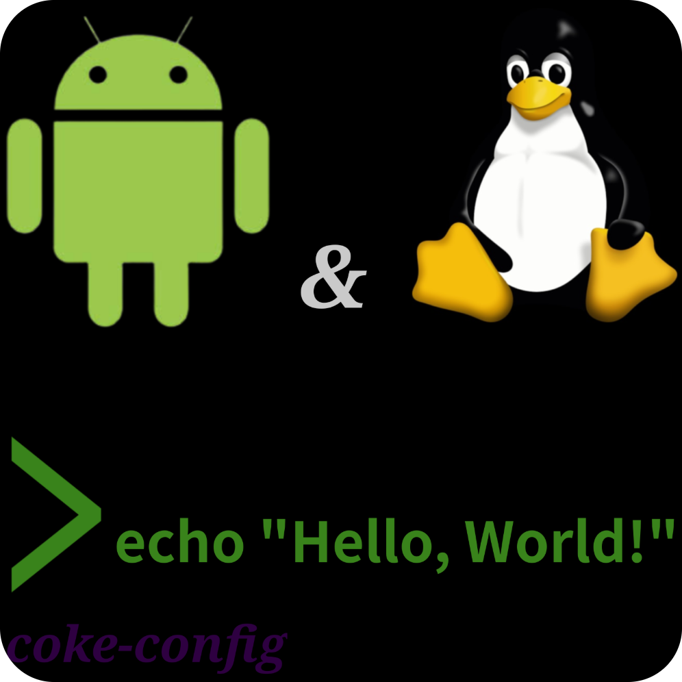

<p align="center">
  
</p>


<h1 align="center">coke-config</h1>


<p align="center">my personal termux dotfiles</p>


<p align="center">
  
  
  
</p>


#### Prior termux or Linux knowledge is reccomended.

## Dependencies


**If using pacman:**
```bash
sh <(curl -fsSL https://raw.githubusercontent.com/byscourge/coke-config/master/.assets/deps/.pacmandeps.sh)
```


**If using apt:**
```bash
sh <(curl -fsSL https://raw.githubusercontent.com/byscourge/coke-config/master/.assets/deps/.aptdeps.sh)
```


## Official installation


```bash
bash <(curl -fsSL https://raw.githubusercontent.com/byscourge/coke-config/master/.assets/deps/.installer.sh)
```
#### The installer script overwrites the entire $HOME directory with this repo's files, and safely backs it up to:
``/data/data/com.termux/files/backup_home/%Y%m%d%H%M%S_home``


example:

``/data/data/com.termux/files/backup_home/20260813214234_home``


<h3>Prerequisite android apps</h3>
<h4>1. Privilege escalation</h4>
<ul>
  <li><a href="https://github.com/RikkaApps/Shizuku">Shizuku</a></li>
   <li><a href="https://github.com/thedjchi/Shizuku">Alternative Shizuku fork by thedjchi</a></li>
</ul>
<h4>2. Android API support</h4>
   <ul>
     <li><a href="https://github.com/termux/termux-api">Termux:API</a></li>
   </ul>
<h4>3. QOL & Special key support</h4>
<ul>
   <li><a href="https://github.com/Julow/Unexpected-Keyboard">Unexpected Keyboard</a></li>
</ul>
<br><br>
<h3>This project may contain assets from:</h3>


<ul>
  
   <li><a href="https://ohmyz.sh/">Oh My Zsh</a></li>


   <li><a href="https://github.com/mayTermux/myTermux">mayTermux/myTermux</a></li>


</ul>

